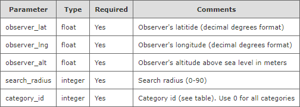
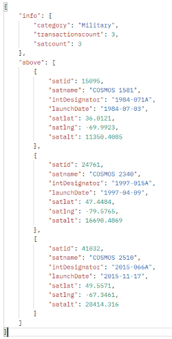

# Satellite Locator: What's Orbiting Above Me?

## NOTE
In order to test this application, a plugin is required to enable Cross Origin Resource Sharing for API calls to N2YO. We recommend using the following browser extension in Chrome: https://mybrowseraddon.com/access-control-allow-origin.html

## Project Overview
Satellite Locator is a web-based application that allows a user to search for satellites above a specified location within a specified range and see the results displayed on an interactive map. Additional information can accessed by clicking each satellite icon to view information about that satellite, specifically its name, launch date, altitude*, latitude* and longitude* (*at the moment the search is submitted). Users can easily recreate previous searches by selecting the previous address from the input field dropdown, which is populated from the browser's local storage.

On initial page load, the user is shown the current position of the International Space Station (ISS) on the map to give a sense of the UI and to answer what may be a lot of users' initial questions (since the ISS is typically the most well-known "satellite"). This also ensures that the UI will always be displaying a satellite on page load as opposed to setting a random address that may or may not have satellites in range at that moment. 

From here, the user can then fill out the input form to search for different categories of satellites within a specified area (in miles) of the address they provide. This functionality is achieved by using fetch methods to the N2YO API for current satellite data and linking the Google Maps JavaScript API in the HTML to then represent the parsed satellite data visually for the user. Additional flexibility in address inputs from the user (i.e. city, address, ZIP, state, country) is achieved by leveraging the Google Maps Geocoding method to then convert these values into latitude and longitude for accessing the N2YO API. The application is powered by JavaScript, HTML, and CSS. Primary CSS styling is pulled from the *insert name* library. The Moment.js library is accessed to reformat the launch dates provided by the N2YO API.

### Libraries/APIs Used
<ul>
<li><a href="https://www.n2yo.com/api/" target="_blank">N2YO API</a></li>
<li><a href="https://developers.google.com/maps/documentation/javascript/overview" target="_blank">Google Maps JavaScript API</a></li>
<li><a href="https://momentjs.com/" target="_blank">Moment.js Library</a></li>
<li>*Add CSS library and link*</li>
</ul>

### Languages Used
<ul>
<li>JavaScript</li>
<li>HTML</li>
<li>CSS</li>
</ul>

## Live Application:
https://captain63.github.io/satellite-tracker/

## Application Screenshot
*Add screenshot once final modifications are finished*

## Contributors
<ul>
<li>Kuba Zhaanbaev</li>
<li>Stephen Roddewig</li>
</ul>

## APIs
 

### __Sattelite tracker__ &nbsp; 
[documentation link...]('https://www.n2yo.com/api/#above')
 
 
Base URL : https://api.n2yo.com/rest/v1/satellite/
  
To get all sattelites above me
 
Request :
/above/{observer_lat}/{observer_lng}/{observer_alt}/{search_radius}/{category_id}
  

  

Example :
 
https://api.n2yo.com/rest/v1/satellite/above/38.846226/-77.306374/0/20/30/&apiKey=V9D6C3-2PPF46-6G6N28-5KZ0
  

Response :
  

  
