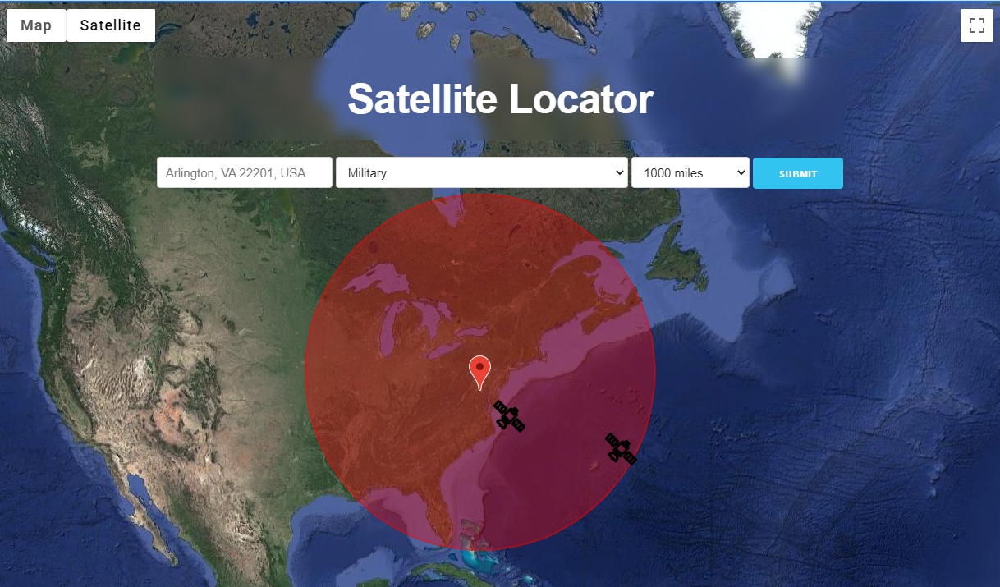

# Satellite Locator: What's Orbiting Above Me?

## Table of Contents
- [Project Overview](#project-overview)
- [Contributors](#contributors)
- [Notes for Development](#notes-for-development)
- [License](#license)
- [Screenshot](#screenshot)

## Project Overview
Satellite Locator is a client-side application that allows a user to search for satellites above a specified location within a specified range and see the results displayed on an interactive map. Additional information can accessed by clicking each satellite icon to view information about that satellite, specifically its name, launch date, altitude*, latitude* and longitude* (*at the moment the search is submitted). Users can easily recreate previous searches by selecting the previous address from the input field dropdown, which is populated from the browser's local storage.

On initial page load, the user is shown the current position of the International Space Station (ISS) on the map to give a sense of the UI and to answer what may be a lot of users' initial questions (since the ISS is typically the most well-known "satellite"). This also ensures that the UI will always be displaying a satellite on page load as opposed to setting a random address that may or may not have satellites in range at that moment. 

From here, the user can then fill out the input form to search for different categories of satellites within a specified area (in miles) of the address they provide. This functionality is achieved by using fetch methods to the N2YO API for current satellite data and linking the Google Maps JavaScript API in the HTML to then represent the parsed satellite data visually for the user. Additional flexibility in address inputs from the user (i.e. city, address, ZIP, state, country) is achieved by leveraging the Google Maps Geocoding method to then convert these values into latitude and longitude for accessing the N2YO API. The application is powered by JavaScript, HTML, and CSS. Primary CSS styling is pulled from the Skeleton.css library. The Moment.js library is accessed to reformat the launch dates provided by the N2YO API.

### Libraries/APIs Used
- [Google Maps JavaScript API](https://developers.google.com/maps/documentation/javascript/overview)
- [N2YO API](https://www.n2yo.com/api/)
- [Moment.js Library](https://momentjs.com/)
- [Skeleton.css Library](http://getskeleton.com/)

### Languages Used
- JavaScript
- HTML
- CSS

## Contributors
- Kuba Zhaanbaev: [kZhaanbaev](https://github.com/kZhaanbaev)
- Stephen Roddewig: [Captain63](https://github.com/Captain63)

## Notes for Development
### NOTE 1: API Keys
In order to test this application, API keys are required for both the Google Maps API and the N2YO API. Once created, add them to the api-keys.js file under assests/js to access the full functionality of the application. Guides for creating both keys are below:
- https://developers.google.com/maps/documentation/javascript/get-api-key
- https://www.n2yo.com/api/

### NOTE 2: Cross Origin Resource Sharing
In order to test this application, a plugin is required to enable Cross Origin Resource Sharing for API calls to N2YO. We recommend using the following browser extension in Chrome: https://mybrowseraddon.com/access-control-allow-origin.html

## License
Permission is hereby granted, free of charge, to any person obtaining a copy of this Software and associated documentation files (the "Software"), to deal in the Software without  restriction, including without limitation the rights to use, copy, modify, merge, publish distribute, sublicense, and/or sell copies of the Software, and to permit persons to whom the Software is furnished to do so, subject to the following conditions.

[View the full license](./LICENSE).

## Screenshot
